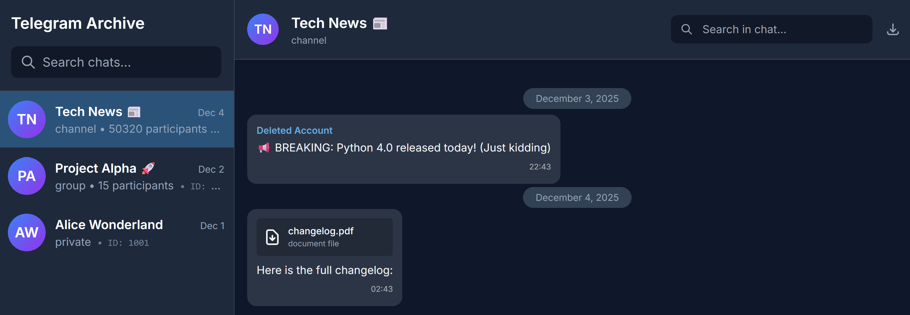
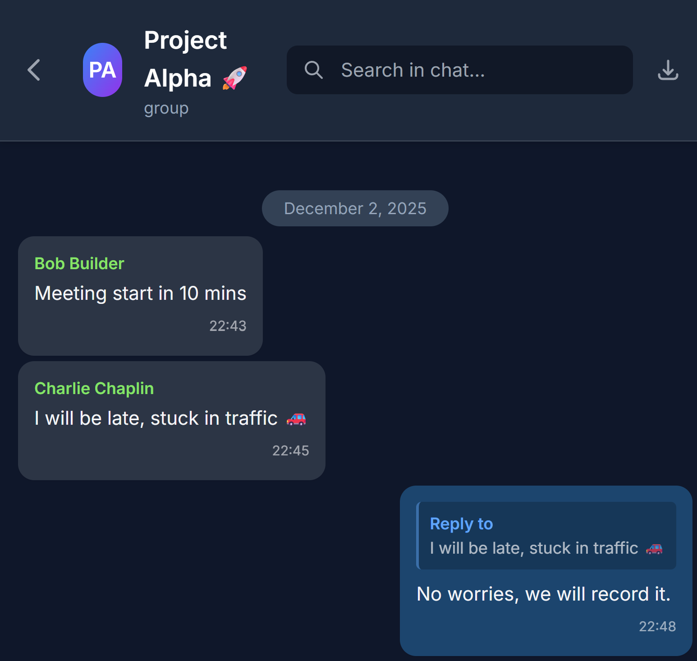

<div align="center">
  
</div>

# Telegram Archive

Automated Telegram backup with Docker. Performs incremental backups of messages and media on a configurable schedule.

## Features

✨ **Incremental Backups** - Only downloads new messages since last backup  
📅 **Scheduled Execution** - Configurable cron schedule  
🐳 **Docker Ready** - Easy deployment with Docker Compose  
🌐 **Web Viewer** - Browse chats with Telegram-like UI (mobile-friendly)  
🔐 **Restricted Viewer** - Share specific chats via `DISPLAY_CHAT_IDS`  
🎵 **Voice/Audio Player** - Play audio messages in browser  
📤 **Chat Export** - Export chat history to JSON  
🎬 **GIF Autoplay** - Animated GIFs play when visible  
📁 **Media Support** - Photos, videos, documents, stickers  
🔒 **Secure** - Optional authentication, runs as non-root  
🗄️ **Multiple Databases** - SQLite (default) or PostgreSQL support (v3.0+)  

## 🗺️ Roadmap

Planned features for future releases:

**Multi-tenancy & Access Control:**
- [ ] **Multi-tenant architecture** - Single instance serving multiple users, each with their own Telegram accounts and private chats
- [ ] **Shared channel access** - Allow multiple users to view specific shared channels
- [ ] **Role-based permissions** - Admin, viewer, and per-chat access controls

**Authentication:**
- [ ] **OAuth/Social login** - Sign in with Google, GitHub, Discord, etc.
- [ ] **Magic link authentication** - Passwordless login via email
- [ ] **OIDC/SAML support** - Enterprise SSO integration

**Viewer Enhancements:**
- [ ] **Full-text search** - Search message content across all chats
- [ ] **Reactions display** - Show message reactions in the web viewer
- [ ] **Chat statistics** - Analytics dashboard with message counts, activity graphs

**Backup Features:**
- [ ] **Real-time sync mode** - Live message sync instead of scheduled backups
- [ ] **Multi-account support** - Backup multiple Telegram accounts simultaneously
- [ ] **S3/Cloud storage** - Store backups in AWS S3, MinIO, or other cloud storage
- [ ] **Encryption at rest** - Encrypt database and media files

**Integrations:**
- [ ] **API endpoints** - REST API for external integrations
- [ ] **Scheduled reports** - Email/webhook notifications with backup summaries
- [ ] **Export formats** - Export to HTML, PDF, or other archive formats

Have a feature request? [Open an issue](https://github.com/GeiserX/Telegram-Archive/issues)!

## 📸 Screenshots

<details>
<summary>Click to view Desktop and Mobile screenshots</summary>

### Desktop


### Mobile


</details>

## Quick Start

### 1. Get Telegram API Credentials

1. Go to https://my.telegram.org/apps
2. Create a new application
3. Note your `API_ID` and `API_HASH`

### 2. Deploy with Docker

```bash
# Clone and configure
git clone https://github.com/GeiserX/telegram-backup-automation
cd telegram-backup-automation
cp .env.example .env
# Edit .env with your credentials

# Authenticate (one-time)
./init_auth.sh  # or init_auth.bat on Windows

# Start services
docker-compose up -d
```

## Web Viewer

Browse your backups (saved locally) at **http://localhost:8000**

Features:
- Telegram-like dark UI
- Photo/video viewer
- Voice note player
- Chat search
- Export to JSON
- Mobile-friendly layout

## Configuration

### Required

| Variable | Description |
|----------|-------------|
| `TELEGRAM_API_ID` | API ID from my.telegram.org |
| `TELEGRAM_API_HASH` | API Hash from my.telegram.org |
| `TELEGRAM_PHONE` | Phone with country code (+1234567890) |

### Optional

| Variable | Default | Description |
|----------|---------|-------------|
| `SCHEDULE` | `0 */6 * * *` | Cron schedule (every 6 hours) |
| `BACKUP_PATH` | `/data/backups` | Backup storage path |
| `DATABASE_DIR` | Same as backup | Database location |
| `DOWNLOAD_MEDIA` | `true` | Download media files |
| `MAX_MEDIA_SIZE_MB` | `100` | Max media file size |
| `CHAT_TYPES` | `private,groups,channels` | Types to backup |
| `LOG_LEVEL` | `INFO` | Logging level |
| `VIEWER_USERNAME` | - | Web viewer username |
| `VIEWER_PASSWORD` | - | Web viewer password |
| `DISPLAY_CHAT_IDS` | - | Restrict viewer to specific chats |
| `SYNC_DELETIONS_EDITS` | `false` | Sync deletions/edits from Telegram |
| `GLOBAL_INCLUDE_CHAT_IDS` | - | Whitelist chats globally |
| `GLOBAL_EXCLUDE_CHAT_IDS` | - | Blacklist chats globally |
| `PRIVATE_INCLUDE_CHAT_IDS` | - | Whitelist private chats |
| `PRIVATE_EXCLUDE_CHAT_IDS` | - | Blacklist private chats |
| `GROUPS_INCLUDE_CHAT_IDS` | - | Whitelist group chats |
| `GROUPS_EXCLUDE_CHAT_IDS` | - | Blacklist group chats |
| `CHANNELS_INCLUDE_CHAT_IDS` | - | Whitelist channels |
| `CHANNELS_EXCLUDE_CHAT_IDS` | - | Blacklist channels |

### Database Configuration (v3.0+)

Telegram Archive supports both SQLite and PostgreSQL.

**SQLite Path Resolution (in priority order):**

| Variable | Description |
|----------|-------------|
| `DATABASE_URL` | Full database URL (highest priority) |
| `DATABASE_PATH` | Full path to SQLite file (v2 compatible) |
| `DATABASE_DIR` | Directory for `telegram_backup.db` (v2 compatible) |
| `DB_PATH` | Full path to SQLite file (v3 style) |
| Default | `$BACKUP_PATH/telegram_backup.db` |

**PostgreSQL Configuration:**

| Variable | Default | Description |
|----------|---------|-------------|
| `DATABASE_URL` | - | Full PostgreSQL URL (takes priority) |
| `DB_TYPE` | `sqlite` | Set to `postgresql` to use PostgreSQL |
| `POSTGRES_HOST` | `localhost` | PostgreSQL host |
| `POSTGRES_PORT` | `5432` | PostgreSQL port |
| `POSTGRES_USER` | `telegram` | PostgreSQL username |
| `POSTGRES_PASSWORD` | - | PostgreSQL password (required) |
| `POSTGRES_DB` | `telegram_backup` | PostgreSQL database name |

**Using PostgreSQL:**

1. Uncomment the `postgres` service in `docker-compose.yml`
2. Set `POSTGRES_PASSWORD` in your `.env`
3. Set `DB_TYPE=postgresql` in your `.env`
4. Uncomment `depends_on` in backup and viewer services
5. Run `docker-compose up -d`

## Upgrading from v2.x to v3.0

v3.0 introduces async database operations and PostgreSQL support. **Existing SQLite databases work automatically** - no migration needed.

The upgrade is transparent:
1. Pull the new image: `docker-compose pull`
2. Restart: `docker-compose up -d`

Your existing data will continue to work. v3 automatically detects v2 environment variables (`DATABASE_PATH`, `DATABASE_DIR`) for backward compatibility.

**Optional: Switch to PostgreSQL**

If you want to migrate from SQLite to PostgreSQL:

1. Stop services: `docker-compose down`
2. Configure PostgreSQL (see above)
3. Run migration: `docker-compose run --rm telegram-backup python -c "from src.db import *; import asyncio; asyncio.run(migrate_sqlite_to_postgres())"`
4. Start services: `docker-compose up -d`

## CLI Commands

```bash
# View statistics
docker-compose exec telegram-backup python -m src.export_backup stats

# List chats
docker-compose exec telegram-backup python -m src.export_backup list-chats

# Export to JSON
docker-compose exec telegram-backup python -m src.export_backup export -o backup.json

# Export date range
docker-compose exec telegram-backup python -m src.export_backup export -o backup.json -s 2024-01-01 -e 2024-12-31

# Manual backup run
docker-compose exec telegram-backup python -m src.telegram_backup
```

## Data Storage

```
data/
├── session/
│   └── telegram_backup.session
└── backups/
    ├── telegram_backup.db
    └── media/
        └── {chat_id}/
            └── {files}
```

## Troubleshooting

| Problem | Solution |
|---------|----------|
| "Failed to authorize" | Run `./init_auth.sh` again |
| "Permission denied" | `chmod -R 755 data/` |

## Limitations

- Secret chats not supported (API limitation)
- Edit history not tracked (only latest version stored; enable `SYNC_DELETIONS_EDITS` to update edits)
- Deleted messages before first backup cannot be recovered

## License

GPL-3.0. See [LICENSE](LICENSE) for details.

Built with [Telethon](https://github.com/LonamiWebs/Telethon).
